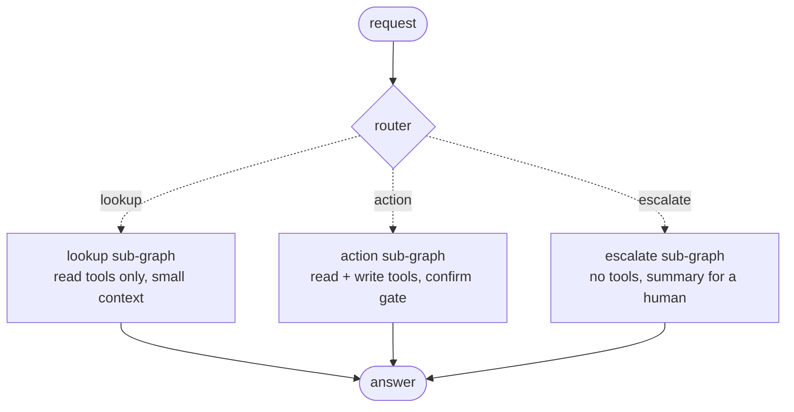
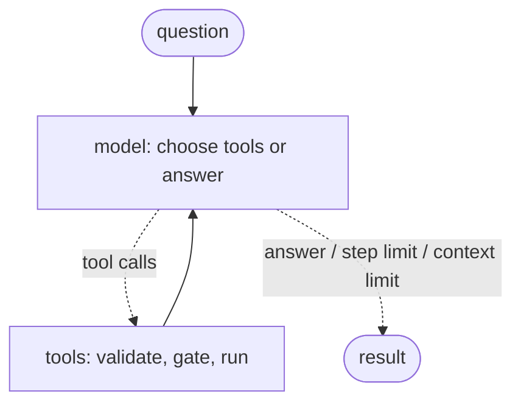
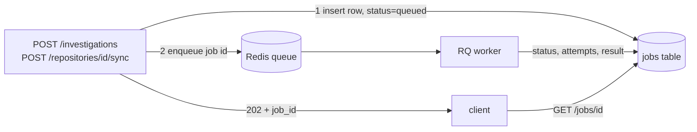

# Maintainer Agent


An assistant for open-source maintainers: it ingests a GitHub repository, indexes its issues,
and answers questions about them with cited sources, finds duplicate issues, and can propose
(but never silently perform) changes.

## How an agent request flows



The router is one LLM call that returns `lookup`, `action` or `escalate`. Anything it cannot
parse goes to `escalate`, so a confused router sends the request to a human instead of to the
write tools.

Each of `lookup` and `action` is the same two-node loop:



Code: `backend/agent/graph.py` (graphs), `backend/agent/loop.py` (the original plain loop the
graph reproduces; both are tested against the same suite), `backend/agent/tools.py`
(registry, validation, timeouts, output truncation).

### The confirmation gate

`post_comment`, `add_label` and `close_issue` never run on the model's say-so. Two modes:

- **queue** (default, used by the API): the call comes back as a *pending action*, stored in
  `pending_actions`; a human approves with `POST /investigations/{id}/confirm`. The row is
  locked while it runs, so two confirms cannot both execute it.
- **interrupt** (`InterruptibleRun`): the LangGraph run pauses before the gated tool and
  resumes with approve/reject. All decisions are collected before anything executes, so
  resuming never re-runs a tool.

### Writing to GitHub (opt-in)

Confirmed actions act **as the logged-in user**, never as the app, and only on repositories
that user owns or administers.

- Off by default. Login requests only `read:user`. To enable writes set
  `GITHUB_OAUTH_SCOPES=read:user,public_repo` and `TOKEN_ENCRYPTION_KEY` (a Fernet key; see
  `.env.example`). Users then log in again to grant the broader scope.
- The user's token is encrypted at rest (Fernet) and only stored when both of those are set.
  `POST /auth/logout` deletes it. If the key changes, stored tokens become unreadable and the
  user is asked to log in again.
- At confirm time the server asks GitHub, with the user's own token, whether they own or
  administer the repository. If not (or the check fails) nothing is written and the action
  stays pending.

### Failure modes the agent is built to survive

| Failure | What happens |
| --- | --- |
| Model loops forever | Hard step cap (default 8); returns a partial answer built from the tool results so far. |
| Model calls a tool that does not exist | The error lists the available tools; the model can recover. |
| Model sends bad arguments | Pydantic validation errors go back to the model as text. |
| A tool raises or hangs | Per-tool timeout; a crash returns only the exception type, never its message. |
| Huge tool output | Truncated with `…[truncated N tokens]` before it enters the context. |
| Context grows too large | Oldest tool results are shrunk first; if it still does not fit, the run stops with a partial answer. |
| Model cites an issue it was not shown | The answer is re-asked once, then rejected and withheld. |
| Issue text tries to give instructions | Issue text is delimited as data and the system prompt says so; the router and judge treat inputs the same way. |

## Background jobs (queue)

Long work (an investigation, a repository sync) runs on a worker, not in the request:



- **Postgres is the source of truth.** The `jobs` row holds status, attempts, result and
  error; Redis only carries the job id. Losing Redis loses the queue, not the history.
- **Idempotency.** Send an `Idempotency-Key` header and a repeated request returns the
  original job (HTTP 200, `deduplicated: true`) instead of starting a second one. Reusing a
  key for a *different* request is a 422. Keys are scoped per user, and a unique constraint
  settles two simultaneous requests with the same key.
- **Bounded retries.** A failing job gets `JOB_MAX_RETRIES` extra attempts (default 3) with
  growing delays (`JOB_RETRY_DELAYS_S`, default 10, 30, 90 seconds). The final attempt records
  the failure and does not raise, so the queue cannot retry beyond the bound. Failures that a
  retry cannot fix (no LLM configured, repository missing, GitHub rate limit) fail at once.
  A job that already finished is never run again if the queue redelivers it.
- **Backpressure.** Once `MAX_QUEUE_DEPTH` jobs are queued or running, new requests get
  `429` with `Retry-After`. Replays of already-accepted work are still answered.
- **Worker.** `uv run python -m backend.worker` (it runs RQ's scheduler, which is what moves
  delayed retries back onto the queue).

## Web UI

`frontend/` is a Next.js app: log in with GitHub, add and sync repositories, chat about a
repository with a sources panel, and approve or reject proposed changes.

```bash
cd frontend && npm ci && npm run build && npm start      # http://localhost:3000
```

- **One origin.** The UI forwards `/api/*` to the backend (`BACKEND_URL`, default
  `http://localhost:8000`), so the httpOnly login cookie is first-party and no CORS is needed.
  Register `http://localhost:3000/api/auth/callback` as the OAuth app's callback URL, and set
  `GITHUB_OAUTH_REDIRECT_URI` to the same value and `POST_LOGIN_REDIRECT=/`.
- **Live status.** A question becomes a background job; the page follows it over
  Server-Sent Events (`GET /jobs/{id}/events`) and shows queued, working and retry states. The
  answer appears when it is complete, with its cited issues linked to GitHub. Answers are not
  streamed token by token: citations are validated against the full answer first.
- **Proposed changes.** Writes the agent proposes show up with Approve / Reject; nothing
  runs until someone clicks Approve, and the server re-checks that the person owns the repository.

Checks: `npm run typecheck`, `npm test` (unit tests), and `npm run e2e`: a real browser
(Chromium via Playwright) against the real stack (FastAPI, Postgres, Redis, the worker, Next.js)
with only the LLM and GitHub faked. It needs Postgres running and migrated, `redis-server`, and a
built UI, and cleans up its own data.

## Using it from Claude (MCP)

`backend/mcp_server.py` is a read-only MCP server (`search_issues`, `get_issue`,
`list_recent_commits`, `get_pr`). It deliberately has no write tools: comments, labels and
closing issues only happen through the confirmation gate in the HTTP API.

```bash
claude mcp add maintainer-agent -- uv run --directory /path/to/maintainer_agent \
  python -m backend.mcp_server
```

For Claude Desktop add this to `claude_desktop_config.json`:

```json
{
  "mcpServers": {
    "maintainer-agent": {
      "command": "uv",
      "args": ["run", "--directory", "/path/to/maintainer_agent",
               "python", "-m", "backend.mcp_server"]
    }
  }
}
```

Repositories must be ingested first (`POST /repositories/{id}/sync`, or the CLIs below).

## Running it

```bash
uv sync
cp .env.example .env        # fill in values
docker compose up -d        # Postgres (pgvector) and Redis
uv run alembic upgrade head
uv run uvicorn backend.main:app --reload
uv run python -m backend.worker   # in a second terminal, for background jobs
uv run pytest
```

Ingest and index a repository:

```bash
uv run python -m backend.ingestion.cli --owner OWNER --repo REPO
uv run python -m backend.retrieval.cli --owner OWNER --repo REPO
```

Evaluate it (needs cases in a JSON file and an LLM key):

```bash
uv run python -m backend.evals.cli load --owner OWNER --repo REPO --file cases.json
uv run python -m backend.evals.cli run  --owner OWNER --repo REPO --name baseline --judge
```

Embeddings default to a local hash embedder so everything runs without keys; set
`EMBEDDING_PROVIDER=openai` and `OPENAI_API_KEY` for real retrieval quality.
